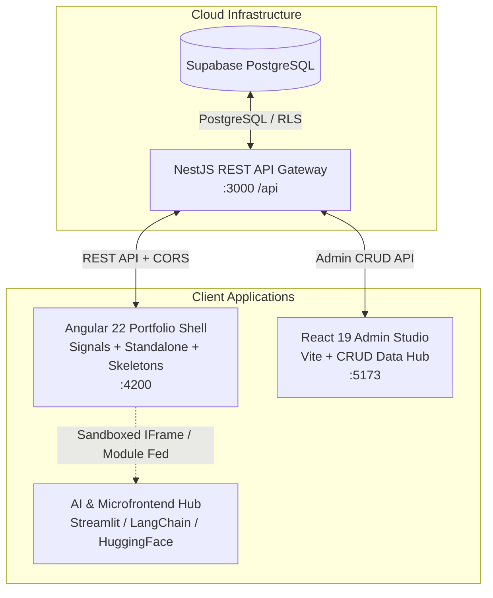

<div align="center">

# Vishnu Thankappan — Enterprise Engineering Portfolio & Architecture Platform

[](https://angular.dev)
[](https://react.dev)
[](https://nestjs.com)
[](https://supabase.com)
[](https://nx.dev)
[](https://www.typescriptlang.org)
[](https://render.com)

<p align="center">
  <strong>Production-Grade Full-Stack Monorepo Architecture</strong><br />
  Featuring Angular 22 Signals, React 19 Admin Studio, NestJS REST Microservices, and Supabase Cloud PostgreSQL.
</p>

[Explore Live Shell](https://vishnu-portfolio.onrender.com) • [API Endpoint](https://vishnu-portfolio-api.onrender.com/api/health) • [LinkedIn Profile](https://www.linkedin.com/in/vishnu-thankappan)

</div>

---

## 🏛️ Architecture Overview

This monorepo is engineered using **Nx** to demonstrate scalable, enterprise-grade frontend architecture, strict separation of concerns, microfrontend sandboxing, and real-time backend state synchronization.



---

## ✨ Key Architectural Highlights

### 1. Angular 22 Standalone Shell (`apps/portfolio-shell`)
- **Signal-Driven Reactivity**: Pure signal-based architecture (`signal()`, `computed()`, `input()`) with zero RxJS memory leak overhead.
- **Reusable Animated Skeleton Loaders**: Multi-variant `<app-skeleton-loader>` supporting `hero`, `card-grid`, `timeline-grid`, `article-grid`, and `pill-cloud` formats with fluid shimmer wave animations.
- **Enterprise Dependency Injection**: API base routing managed via typed `InjectionToken<AppEnvironment>('APP_CONFIG')` with automatic build-time file replacements (`environment.ts` ➔ `environment.prod.ts`).
- **Security & URL Sanitization**: Custom `SafeResourceUrlPipe` and `SafeUrlPipe` enforcing strict protocol whitelisting (`https://`, `http://`, relative) and static iframe sandboxing (`NG0910` compliant).
- **Persistent Theme Engine**: Zero-FOUC (Flash of Unstyled Content) dark/light mode synchronization using pre-paint inline scripts and `localStorage`.

### 2. React 19 Admin Studio (`apps/portfolio-admin`)
- **Modern Vite + React 19**: Ultra-fast HMR and bundling with typed environment resolution (`import.meta.env.VITE_API_URL`).
- **Full CRUD Management**: Complete dashboard with tabs for Profile, Experience Timeline, Architectural Projects, Multi-Platform Technical Writing (Medium, Dev.to, LinkedIn), Demos, and Skills.
- **Automated Seeding & Health Monitoring**: One-click database seed button and real-time backend connectivity indicator.

### 3. NestJS REST API Gateway (`apps/api`)
- **Dynamic Supabase Integration**: Seamless live querying from Supabase PostgreSQL tables with built-in graceful in-memory fallback caching when offline.
- **Security & CORS**: Fully configurable global CORS policies and route prefixes (`/api`).
- **PostgreSQL DDL & RLS**: Complete relational schema and Row-Level Security policies included in `supabase/schema.sql`.

---

## 📂 Monorepo Structure

```text
vishnu-portfolio/
├── apps/
│   ├── api/                        # NestJS 11 REST API Backend
│   │   ├── src/app/
│   │   │   ├── supabase/          # Supabase Client & Local Cache Engine
│   │   │   └── *.controller.ts    # REST Controllers (profile, experience, etc.)
│   │   └── tsconfig.app.json
│   │
│   ├── portfolio-shell/           # Angular 22 Enterprise Host Portfolio
│   │   ├── src/app/
│   │   │   ├── core/              # Config Tokens & Security Pipes
│   │   │   ├── layout/            # Sticky Header, Nav Drawer & Footer
│   │   │   ├── pages/             # Home, Experience, Projects, Writing, Demos
│   │   │   ├── services/          # PortfolioApiService (Signal Store)
│   │   │   └── ui/                # Reusable SkeletonLoaderComponent
│   │   └── src/environments/      # Environment Matrix (dev, prod, models)
│   │
│   └── portfolio-admin/           # React 19 Admin Studio Dashboard
│       ├── src/
│       │   ├── components/        # CRUD Forms & Modals
│       │   ├── services/          # AdminApi Client
│       │   └── types/             # Shared TypeScript Contracts
│       └── vite.config.ts
│
├── libs/
│   └── shared/models/             # Monorepo-wide Domain Models & Interfaces
│
├── supabase/
│   └── schema.sql                 # PostgreSQL DDL, Indexes & Seed Script
│
├── render.yaml                    # Infrastructure-as-Code Blueprint
├── nx.json                        # Nx Workspace & Caching Configuration
└── package.json                   # Root Workspace Scripts & Dependencies
```

---

## 🚀 Quick Start (Local Development)

### Prerequisites
- **Node.js**: `v20.x` or higher
- **npm**: `v10.x` or higher

### 1. Clone & Install Dependencies
```bash
git clone https://github.com/TechieWithBeard/vishnu-portfolio-app.git
cd vishnu-portfolio-app
npm install
```

### 2. Environment Configuration
Create a `.env` file in the root directory (refer to `.env.example`):
```env
PORT=3000
SUPABASE_URL=https://your-project.supabase.co
SUPABASE_ANON_KEY=your-supabase-anon-key
SUPABASE_SERVICE_ROLE_KEY=your-supabase-service-role-key
```

### 3. Launch Applications
Run the development servers concurrently in separate terminals:

```bash
# 1. Start NestJS REST API (Port 3000)
npm run start:api

# 2. Start Angular Portfolio Shell (Port 4200)
npm run start:shell

# 3. Start React Admin Studio (Port 5173)
npm run start:admin
```

---

## 🛠️ Build & Verification Scripts

| Command | Purpose |
| :--- | :--- |
| `npm run typecheck` | Validates TypeScript compilation across all 3 apps with zero emit |
| `npm run build:api` | Compiles NestJS backend for production to `dist/apps/api` |
| `npm run build:shell` | Compiles Angular 22 shell with production optimizations to `dist/apps/portfolio-shell/browser` |
| `npm run build:admin` | Builds React 19 Admin studio with Vite to `dist/apps/portfolio-admin` |
| `npm run build:all` | Sequentially builds all three applications for production deployment |

---

## ☁️ Deployment & Infrastructure (Render Blueprint)

The repository includes a ready-to-use **[Render Blueprint (`render.yaml`)](render.yaml)** configuring automated continuous deployment:

```yaml
services:
  - type: web
    name: vishnu-portfolio-api
    runtime: node
    plan: free
    buildCommand: npm install && npm run build:api
    startCommand: npm run start:api:prod
    healthCheckPath: /api/health
    envVars:
      - key: PORT
        value: 3000
      - key: SUPABASE_URL
        sync: false
      - key: SUPABASE_ANON_KEY
        sync: false

  - type: static
    name: vishnu-portfolio
    buildCommand: npm install && npm run build:shell
    staticPublishPath: dist/apps/portfolio-shell/browser
    routes:
      - type: rewrite
        source: /*
        destination: /index.html

  - type: static
    name: vishnu-portfolio-admin
    buildCommand: npm install && npm run build:admin
    staticPublishPath: dist/apps/portfolio-admin
    routes:
      - type: rewrite
        source: /*
        destination: /index.html
```

---

## 🔒 Security Best Practices Implemented

1. **Zero Secret Leaks**: `.env` and sensitive files are strictly ignored via `.gitignore`. Secrets are injected securely via Render Environment Variables.
2. **Content Security & Protocol Whitelisting**: Dynamic URL embeds are filtered through `SafeResourceUrlPipe` and `SafeUrlPipe` to prevent `javascript:` XSS vectors.
3. **Static Iframe Sandboxing**: Configured with strict sandboxing attributes (`allow-scripts allow-same-origin allow-forms allow-popups`) preventing privilege escalation.
4. **PostgreSQL Row-Level Security (RLS)**: Public read access enabled on portfolio tables with restricted write policies.

---

## 👨‍💻 Author & Engineering Profile

**Vishnu Thankappan**  
*Senior Frontend Engineer • UI & AI Architect*  
- **LinkedIn**: [linkedin.com/in/vishnu-thankappan](https://www.linkedin.com/in/vishnu-thankappan)
- **GitHub**: [github.com/TechieWithBeard](https://github.com/TechieWithBeard)
- **Specializations**: Angular 22 (Signals), React 19, Nx Monorepos, AI/LLM Streaming Interfaces, Design Systems, High-Performance Web Architecture.

---

## 📄 License

This project is open source and available under the [MIT License](LICENSE).
